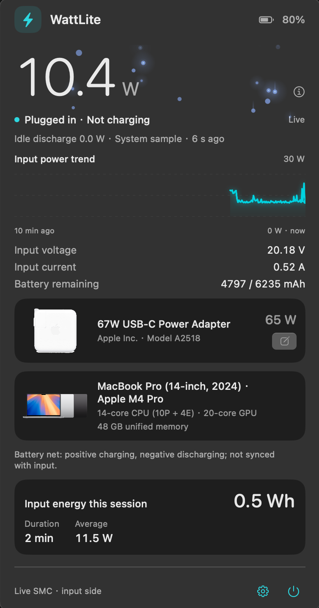
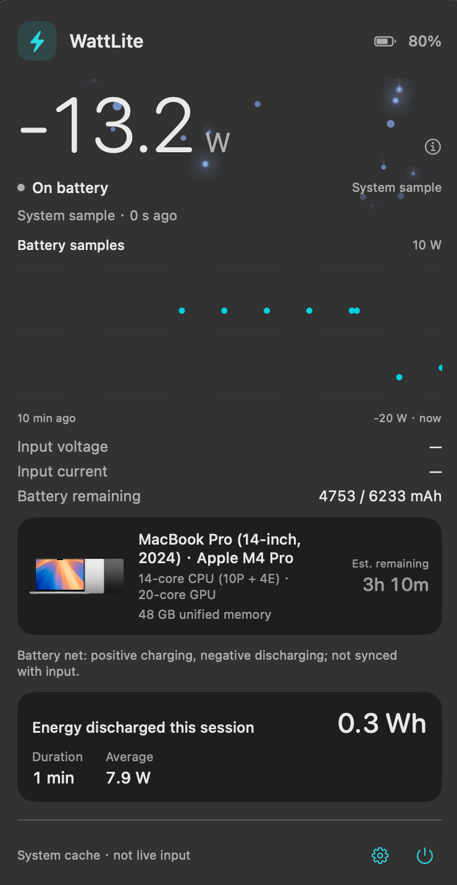
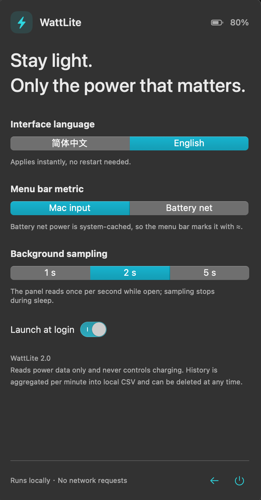

# WattLite

<p align="center">
  <b>A macOS menu bar power monitor.</b><br>
  It answers two questions and nothing else:<br>
  how many watts is this Mac pulling right now,<br>
  and is the battery netting charge or discharge.
</p>

<p align="center">
  <a href="https://github.com/GabrielZZZ/WattLite/releases/latest"></a>
  
  
  
  
  
</p>

<p align="center"><b>English</b> · <a href="README.zh-CN.md">简体中文</a></p>

<p align="center">
  
</p>

The big number, the trend line and the particle flow all track the machine's actual draw.

It lives in the menu bar (`LSUIElement`, no Dock icon); click it for the power panel.
It never controls charging, never makes a network request, and never reads your serial number.

## Menu bar

One monospaced number with a fixed width, so it never shoves the rest of your menu bar sideways when it jumps.

- **Bolt icon** carries an energy-flow animation: upward while charging, downward on battery, a slow ambient drift when plugged in but not charging.
- **Cached values** are prefixed with `≈` instead of pretending to be real time.
- **Format** reads `⚡ 67W · In 10.2 W`.

<p align="center">
  
</p>

## Panel

| Block | Shows | Source |
| --- | --- | --- |
| Big number | Input power or battery net power | SMC key `PDTR`, read-only I/O Kit call (`Sources/SMC.c`) |
| Particle flow | Faster when the machine draws more | Local animation, no extra sampling |
| Trend | Last 10 minutes | 1 sample / second while the panel is open |
| Input voltage / current | Instantaneous V and A | Same SMC batch |
| Battery capacity | Current / full-charge mAh | `AppleSmartBattery` |
| Adapter card | Name, vendor, model, rated watts, product art | `AdapterDetails` + USB PD `FedDetails` |
| Mac card | Exact marketing name, CPU/GPU cores, memory | `system_profiler` + identifier lookup table |
| Session energy | Wh, duration, average since plugged in | Integrated from samples |

**Battery net power** = voltage × signed current: positive is charging, negative is discharging. The system refreshes it roughly once a minute, out of phase with the instantaneous input reading, so the panel deliberately **does not** subtract one from the other.

**What `PDTR` means.** It is input power measured *inside* the Mac — the wall outlet sees more, because the adapter itself burns some.

Unplugged, the same panel switches to the battery view: the trend becomes discrete battery samples, the Mac card gains an estimated time remaining, and the session card counts energy given out instead of taken in.

<p align="center">
  
</p>

## Settings

<p align="center">
  
</p>

| Setting | Options |
| --- | --- |
| Interface language | 简体中文 / English, applied instantly |
| Menu bar metric | Mac input power / battery net power |
| Background sampling | 1 / 2 / 5 seconds |
| Launch at login | on / off |

While the panel is open it samples once per second regardless; sampling stops on sleep and restarts on wake.

## Install

### Download (recommended)

Grab `WattLite-2.0.dmg` from [**Releases**](https://github.com/GabrielZZZ/WattLite/releases/latest) and drag WattLite into `Applications`.

The first launch needs one manual approval: this project has no Apple Developer account, so the build is ad-hoc signed and not notarised, and Gatekeeper blocks every copy that arrives through a browser. Either

- open **System Settings → Privacy & Security** and click **Open Anyway** next to "WattLite was blocked", or
- clear the quarantine flag with `xattr -dr com.apple.quarantine /Applications/WattLite.app`

`WattLite-2.0.zip` works too, but **extract it by double-clicking or with `ditto -x -k`** — `unzip` leaves `._*` resource forks inside the bundle and breaks the signature seal.

After that the menu bar shows `⚡ 67W · In 10.2 W`. Click it for the panel, and turn on **Launch at login** if you want it permanent.

### Build from source

```bash
git clone https://github.com/GabrielZZZ/WattLite.git && cd WattLite
bash build.sh                        # runs the self-checks, then emits build/WattLite.app
open build/WattLite.app

bash build.sh release                # additionally emits build/WattLite-<version>.{dmg,zip}
```

Xcode command line tools only (`xcode-select --install`). No Xcode project, no SwiftPM, no third-party dependencies. Requires Apple Silicon and macOS 14+.

### Self-checks

The self-check is a plain `precondition` executable covering power decoding, edge cases and stale data, session energy integration, and the model identifier table.

```bash
build/checks             # PASS: ...
build/checks --live      # samples 8 more seconds and cross-checks SMC against V×I
```

## Model and artwork detection

`system_profiler` only returns a generic name ("MacBook Pro"). The exact marketing name comes from a 72-entry identifier table in `Sources/MacModels.swift`, sourced from Apple's official model identification pages. Artwork is keyed by identifier, because one marketing name can ship different hardware looks (M4 vs M4 Pro/Max).

Lookup is **user directory first, bundle second**, tried key by key:

```text
~/Library/Application Support/WattLite/adapters/<key>.png   # yours
Contents/Resources/Adapters/<key>.png                       # shipped
```

- **Mac**: `mac16-8` (identifier) → `macbook-pro` (generic)
- **Adapter**: `apple-67w` (Apple bricks, by wattage) → `22D9:001B` (third party, by VID:PID)

Shipped: 72 official Mac product images + 9 Apple adapter images (20/29/35/61/67/70/87/96/140 W), all normalised to 600×600 transparent squares with the cable cropped out.

Third-party chargers usually report nothing but `pd charger` over USB PD, so there is nothing to auto-detect — the pencil button on the adapter card lets you set name / model / protocol and upload your own product image. Entries are saved to `adapters.json` and override the built-ins.

## History

Aggregated per minute into a local CSV:

```text
~/Library/Application Support/WattLite/history/YYYY-MM-DD.csv
# ts,input_w,battery_w,percent,full_charge_mah,connected
```

The CSV *is* the export format — no database, no background uploader. Delete the folder to wipe everything.

## Known limitations

- **Ad-hoc signed, not notarised** (no Apple Developer account). Downloaded copies need the one-off approval above; a build you compiled yourself is unaffected.
- **Not calibrated against an external power meter.** `PDTR` is machine-side input power, not wall power.
- **Apple Silicon only**: `build.sh` hardcodes `arm64-apple-macosx14.0`. Add a universal target yourself for Intel.
- **Missing artwork**: no official art available for the 30 W / 240 W Apple adapters. The adapter `Model` hex → A-number table has only two field-verified entries (`0x7016 → A2518`, `0x7002 → A2166`); there is no authoritative public source for the rest, so we do not guess.

## Release notes

**v2.0** — first packaged release, downloadable as `.dmg` / `.zip`.

- Mac model resolved to its exact marketing name (72-entry identifier table) and matched to official artwork by identifier
- 9 Apple adapter wattage classes shipped, normalised to transparent squares, brick only
- Third-party chargers can be described by hand (name / model / protocol + your own image); user entries override built-ins
- Session energy card added (Wh, duration, average)
- Panel reduced to one big number with power-driven particles; popover height pinned so it stops resizing between adapter and battery states
- Full English interface, switchable from Settings without restarting

## License

MIT, see [LICENSE](LICENSE). Product images under `Assets/Adapters/` are Apple's own assets and remain © Apple Inc.
