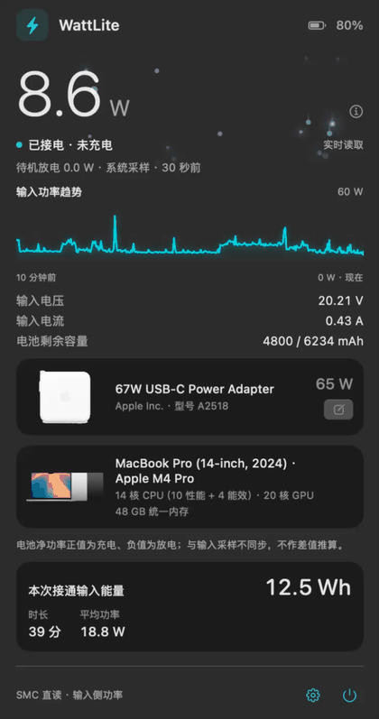
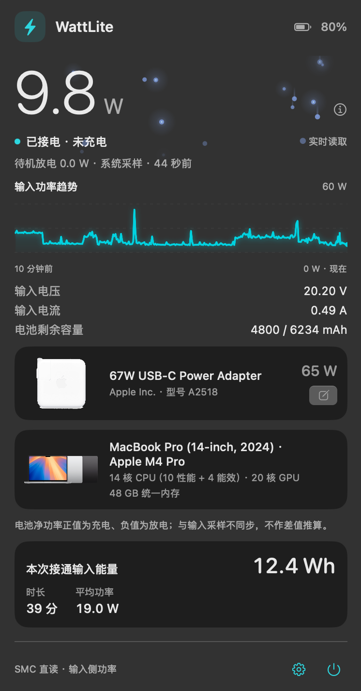
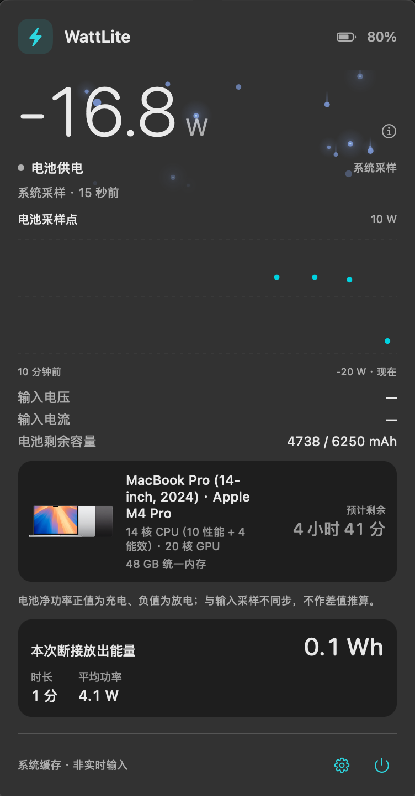
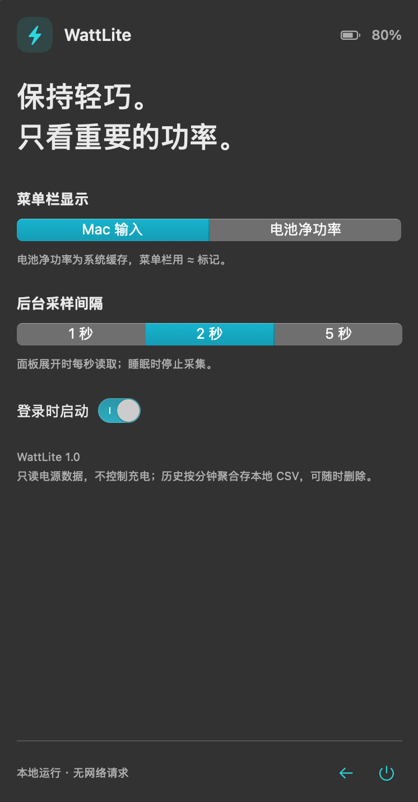

# WattLite

<p align="center">
  <b>macOS 菜单栏功率监视器。</b><br>
  只回答两个问题：<br>
  这台 Mac 此刻吃进多少瓦，<br>
  电池此刻净充 / 净放多少瓦。
</p>

<p align="center">
  <a href="https://github.com/GabrielZZZ/WattLite/releases/latest"></a>
  
  
  
  
  
</p>

<p align="center"><a href="README.md">English</a> · <b>简体中文</b></p>

<p align="center">
  
</p>

菜单栏常驻（`LSUIElement`，无 Dock 图标），点开是功率面板。不控制充电、不发送任何网络请求、不采集序列号。

> 大数字、趋势线和粒子流都跟着机器真实功耗走。SMC 键 `PDTR` 读的是机器*内部*的输入功率，插座端会更高一些，因为适配器自身也在耗电。

## 菜单栏

一个等宽数字，宽度固定，跳数时不左右挤动。

- **bolt 图标**带能量流动画：充电上行 / 放电下行 / 接电未充慢速环境流。
- **缓存值**会显式加 `≈` 标记，不冒充实时值。
- **格式**为 `⚡ 67W · 入 10.2 W`。

<p align="center">
  
</p>

## 面板

<p align="center">
  
  
</p>

<p align="center"><sub>左：接电状态 · 右：电池供电状态</sub></p>

| 区块 | 内容 | 来源 |
| --- | --- | --- |
| 大数字 | 输入功率或电池净功率 | SMC `PDTR`，IOKit 只读调用（`Sources/SMC.c`） |
| 粒子流 | 功率越大流动越快 | 本地动画，无额外采样 |
| 趋势 | 近 10 分钟曲线 | 面板展开时每秒采样 |
| 输入电压 / 电流 | 瞬时 V、A | 同一批 SMC 读数 |
| 电池剩余容量 | 当前 / 满充 mAh | `AppleSmartBattery` |
| 适配器卡 | 名称、厂商、型号、额定功率、产品图 | `AdapterDetails` + USB PD `FedDetails` |
| 本机卡 | 精确营销名、CPU/GPU 核心、内存 | `system_profiler` + 标识符查表 |
| 本次接通输入能量 | Wh、时长、平均功率、一个生活化换算 | 采样积分 |

**电池净功率** = 电压 × 有符号电流，正值充电、负值放电；系统约每分钟更新一次，与输入瞬时值不同步，所以面板**不做两者差值推算**。

拔掉电源后同一个面板切到电池视图（上图右侧）：趋势变成离散的电池采样点，本机卡多出一项预估剩余时间，能量卡改为统计放出而非吃进的能量。

**生活化换算**：能量卡右下角给一条看得懂的参照，共 9 档——🍌 香蕉、🔋 5 号电池、💡 LED 灯、💧🫖 烧水（一杯 / 一升）、📺 电视、💨 吹风机、⚡ 1 度电、🚗 电动车公里数。取的是「本次能量真正达到过的最高一档」，所以数字恒 ≥ 1，不会出现 ≈ 0.05 节电池。香蕉、5 号电池和两档烧水是精确算出来的；电器那几档是「标称功率 × 典型时长」的量级估算，所以每条都带 `≈`。

界面完整支持英文，设置里切换立即生效、无需重启。

## 设置

<p align="center">
  
</p>

| 设置项 | 可选值 |
| --- | --- |
| 界面语言 | 简体中文 / English，切换立即生效 |
| 菜单栏指标 | Mac 输入功率 / 电池净功率 |
| 后台采样间隔 | 1 / 2 / 5 秒 |
| 登录时启动 | 开 / 关 |

面板展开时固定每秒采样，睡眠时停止采集并在唤醒后重新采样。

## 安装

从 [**Releases**](https://github.com/GabrielZZZ/WattLite/releases/latest) 下载 `WattLite-2.1.dmg`，打开后把 WattLite 拖进 `Applications`。

首次打开需要放行一次：项目没有 Apple Developer 账号，因此是 ad-hoc 签名、未经公证，Gatekeeper 会拦下所有从浏览器下载的副本。二选一：

- **系统设置 → 隐私与安全性**，在"已阻止使用 WattLite"处点 **仍要打开**；
- 终端去掉隔离标记：`xattr -dr com.apple.quarantine /Applications/WattLite.app`

也可以用 `WattLite-2.1.zip`，但**必须双击或用 `ditto -x -k` 解压**——`unzip` 会把资源派生数据解成一堆 `._` 文件留在包里，签名封条当场失效。

装好后菜单栏出现 `⚡ 67W · 入 10.2 W`，点它展开面板。设置里可打开**登录时启动**。

## 从源码构建

```bash
git clone https://github.com/GabrielZZZ/WattLite.git && cd WattLite
bash build.sh                        # 先跑自检，再产出 build/WattLite.app
open build/WattLite.app

bash build.sh release                # 额外产出 build/WattLite-<版本>.{dmg,zip}
```

只需要 Xcode 命令行工具（`xcode-select --install`）。没有 Xcode 工程、没有 SwiftPM、没有第三方依赖。要求 Apple Silicon + macOS 14+。

## 自检

自检是一个纯 `precondition` 的可执行程序，覆盖功率解码、边界与陈旧数据、会话能量积分、机型标识符查表。

```bash
build/checks             # PASS: ...
build/checks --live      # 再采 8 秒真实数据，对照 SMC 与 V×I
```

## 机型与产品图自动联动

`system_profiler` 只给泛称（"MacBook Pro"），精确营销名由 `Sources/MacModels.swift` 的标识符查表得到（72 项，来源为 Apple 官方机型识别页）。产品图按标识符配图，因为同一营销名会有不同外观（M4 与 M4 Pro/Max 的机器图不同）。

查找顺序是**用户目录优先，bundle 兜底**，逐个键尝试：

```text
~/Library/Application Support/WattLite/adapters/<key>.png   # 你放的
Contents/Resources/Adapters/<key>.png                       # 内置的
```

- **本机**：`mac16-8`（标识符）→ `macbook-pro`（泛称）
- **适配器**：`apple-67w`（苹果头按功率档）→ `22D9:001B`（第三方按 VID:PID）

内置 72 张 Mac 官方产品图 + 9 档苹果适配器图（20/29/35/61/67/70/87/96/140 W），适配器统一为 600×600 透明方图、只保留机身。

第三方充电头在 USB PD 里通常只报 `pd charger`，无法自动识别品牌型号，因此适配器卡上的铅笔按钮支持自行填写名称 / 型号 / 协议并上传产品图，存进 `adapters.json`，用户条目覆盖内置条目。

## 历史数据

按分钟聚合写本地 CSV：

```text
~/Library/Application Support/WattLite/history/YYYY-MM-DD.csv
# ts,input_w,battery_w,percent,full_charge_mah,connected
```

CSV 本身就是导出格式，没有数据库、没有后台上传进程；删掉目录即清空。

## 已知限制

- **未签名**（ad-hoc 签名，无 Apple Developer 账号，因此也无法公证）。从浏览器下载的 `.dmg` / `.zip` 首次打开会被 Gatekeeper 拦，见上文「安装」；自己 `bash build.sh` 编译出的副本不受影响。
- **精度未经外部功率计校准**。`PDTR` 是机器侧输入功率，不是插座端功率。
- **只支持 Apple Silicon**：`build.sh` 的编译目标写死 `arm64-apple-macosx14.0`，要跑 Intel 得自己加通用二进制目标。
- **素材缺口**：30 W / 240 W 档苹果适配器暂无公开原图；适配器 `Model` 十六进制 → A 编号的对照表目前只有 2 条经实测确认（`0x7016 → A2518`、`0x7002 → A2166`），没有权威公开来源，因此不猜。

## 更新记录

**v2.1** — 会话能量改用生活单位。

- 能量卡右下角新增一条换算，9 档取本次能量达到过的最高一档（香蕉 → 5 号电池 → LED 灯 → 烧水 → 电视 → 吹风机 → 度电 → 电动车公里数），计数恒 ≥ 1
- 中英文界面都有这条；VoiceOver 读到的是剥掉 emoji 的纯文字

**v2.0** — 第一个正式发行版，提供 `.dmg` / `.zip` 直接下载安装。

- 本机型号自动识别到精确营销名（72 项标识符查表），并按标识符自动配官方产品图
- 苹果适配器内置 9 档功率图，统一 600×600 透明方图、只保留机身
- 第三方充电头可自建档案：名称 / 型号 / 协议 + 上传产品图，用户条目覆盖内置条目
- 新增本次接通输入能量卡（Wh、时长、平均功率）
- 面板统一为单个大数字 + 功率驱动的粒子流；popover 高度固定，不再在接电 / 电池两态间抖动
- 界面完整支持英文，设置里可切换，无需重启

## 许可

MIT，见 [LICENSE](LICENSE)。`Assets/Adapters/` 内的产品图为 Apple 官方素材，版权归 Apple Inc.
